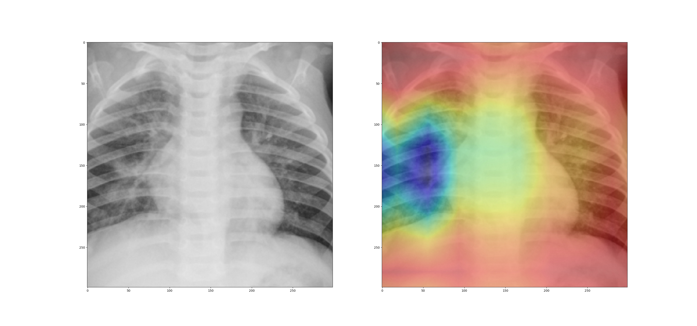
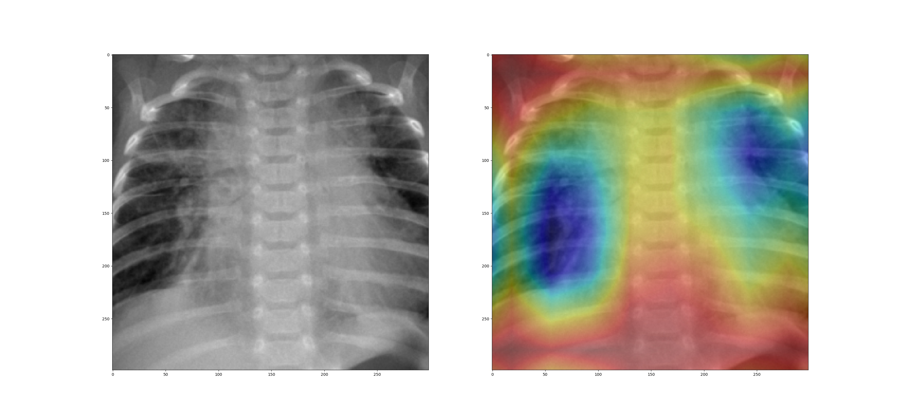

## Pneumonia Detection

It is well known that medical diagnosis takes more time than deciding treatment for the condition. It might require plenty of time and skills of medical practitioners. In recent times, COVID-19 spread across the globe made computer researchers work toward faster and more accurate medical diagnosis solutions for hospitals. 

This project contains the code for diagnosing pneumonia from the chest X-ray images.

- - -

Dataset can be found here: [Chest-XRayDataset](https://www.kaggle.com/praveengovi/coronahack-chest-xraydataset)

Trained Models can be found here: [Trained Models](https://drive.google.com/drive/folders/1fx8SVrtOdtTdeOXox7aAZGe6RzjcW5Uk?usp=sharing)

- - -

## Instructions

* Install required packages from `requirements.txt`
* You can download, extract and move the data according to the label using data.py

  * `pip install kaggle`
  * Download Kaggle API key from your Kaggle Account. Go to `www.kaggle.com -> My Account -> Create New API token`
  * Place the file in on your home directory `$(HOME)/.kaggle/kaggle.json`.
  * Kaggle module will look for this token at `~/.kaggle/kaggle.json` on Linux, OSX, and other UNIX-based operating systems, and at `C:\Users\<windows-username>\.kaggle\kaggle.json` on Windows.
  * execute `python data.py`
* Run `main.py` to train from the dataset. For example, `python main.py --base_model {base_model} --optimizer {optimizer} --learning_rate {learning_rate} --batch_size {batch_size} --epoch {epoch} --nvidiadali --colab`

  * To change pretrained base model, give input while initializing the model object. Use values from 

    * ResNet18 
    * ResNet34
    * ResNet50
    * ResNet101
    * ResNet152
    * Alexnet 
    * VGG11
    * VGG13
    * VGG16
    * VGG19
    * GoogleNet
    * Inception
  * If using colab for training, mount the drive and use --colab to save the files in the drive
  * For faster training and Image augmentation, if on Linux, NVIDIA DALI can be used

    * Install NVIDIA DALI
    * Use --nvidiadali flag to use it
    * Note that NVIDIA DALI is only available for Linux
  * To change optimizers, use one of the following

    * Adam
    * SGD
    * RMSprop
    * Adagrad
    * Adadelta
* To test new dataset, run `test.py` with directory path and base model with option given above. Make sure that model is trained on those models first. 

  * Example, `python3 test.py "./data/Corona_Classification_data/test/" Inception True True`
* To generate a Class Activation Map from a trained model, after training it, use `CAM.py` like `python3 CAM.py {Model_Name} {Path_to_Image}`

  * Example, `python3 CAM.py Inception "./data/abc.jpg"`
  * This will save the output as CAM_{Model_Name}.jpg in the current directory

- - -

## Details

This project uses PyTorch for implementation. The main idea is the support the task with transfer learning technique and give more time in training rather than creating a model. Don't be a Hero, use transfer learning.

* `data.py` file will download the dataset from the kaggle. For that, your kaggle account API needs to be in the proper place. Read the instruction section above for more information on that. Most of the files contain useful information for detection in the central region. To save computation time in transformation cropping all the files are centrally cropped and saved in place of the original file. Code for the same is available in `preprocessor.py` used in `data.py`. Some of the files were identified as useless as they were **extremely bad**. Those images are removed.
* Two directories `model` and `model_results` are used for saving training-testing history and their results respectively. Models are saved in the model directory. Saved Models are not included in the repository. They can be downloaded from the link given at the start of the page and moved to the `model` directory.
* `main.py` file is taking arguments and launching model training according to the arguments. This repository can be trained in the Google Colab as well. For saving files in google drive, mount the google drive and use `--colab` flag as mentioned in the instructions.
* `model.py` contains the code for creating/loading the model and training, testing, and CAM. The model class will look in the `model` directory for the saved model of the base_model argument. If present it will load it, otherwise weights are downloaded from the internet. (These weights are obtained from training Imagenet, not the Pneumonia Detection project. Models on the drive are traineToataset.)

  * To avoid overfitting and making model more accurate these transformations are applied to the training data.
* On PyTorch DataLoader ( Time Taken approx: 130 seconds per epoch)

  ```python
  # Different image transformations for training, testing and displaying
  self.train_transformation = torchvision.transforms.Compose(
      [
          torchvision.transforms.RandomHorizontalFlip(),
          torchvision.transforms.RandomVerticalFlip(),
          torchvision.transforms.RandomRotation(25),
          torchvision.transforms.RandomResizedCrop(
              pretrained_models[self.base_model][2],
              scale=(0.4, 1.0),
              ratio=(0.5, 1.5),
              interpolation=2,
          ),
          torchvision.transforms.ToTensor(),
          torchvision.transforms.Normalize(
              mean=[0.485, 0.456, 0.406], std=[0.229, 0.224, 0.225]
          ),
      ]
  )
  ```
* On NVIDIA-DALI (Time Taken approx: 5-8 seconds per epoch)

  ```python
  class HybridPipelineTrain(Pipeline):
      def __init__(self, batch_size, output_size, num_threads, device_id, images_directory):
          super(HybridPipelineTrain, self).__init__(batch_size, num_threads, device_id, seed = 12)
          self.input = ops.FileReader(file_root = images_directory, random_shuffle = True, initial_fill = 21)
          self.decode = ops.ImageDecoder(device = "mixed", output_type = types.RGB)
          self.rotate = ops.Rotate(device = "gpu")
          self.RRC = ops.RandomResizedCrop(size = output_size,
              random_area = [0.4, 1.0],
              random_aspect_ratio = [0.5, 1.5],
              device="gpu"
          )
          self.cmn = ops.CropMirrorNormalize(
          device="gpu",
          dtype=types.FLOAT,
          mean=[0.485, 0.456, 0.406], std=[0.229, 0.224, 0.225],
          output_layout="HWC")
          self.rng = ops.random.Uniform(range = (-25.0, 25.0))
          self.coin = ops.random.CoinFlip(probability = 0.5)
          self.flip = ops.Flip(device = "gpu")

      def define_graph(self):
          jpegs, labels = self.input()
          images = self.decode(jpegs)
          images = self.flip(images, horizontal = self.coin(), vertical = self.coin())
          angle = self.rng()
          images = self.rotate(images, angle=angle)
          images = self.RRC(images)
          images = self.cmn(images)
          # images are on the GPU
          return (images, labels)
  ```
* Early stopping is also available with the threshold of 4 misses. It can be changed in `main.py` in the train method argument of the model.
* Training can be accelerated with NVIDIA-DALI. It is only available for Linux. Install it before executing for DALI. Use appropriate flags.
* `CAM.py` is used for plotting the Class Activation Map of an image by the model. For Example, the below two images are CAM of two different X-Ray with Inception model.

  

  

  - - -

  Dive into the code. Please show some 💙 by starring ⭐ the repository and spreading the words.